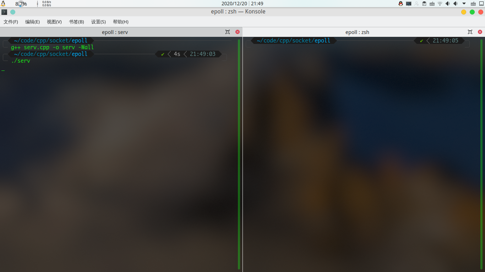
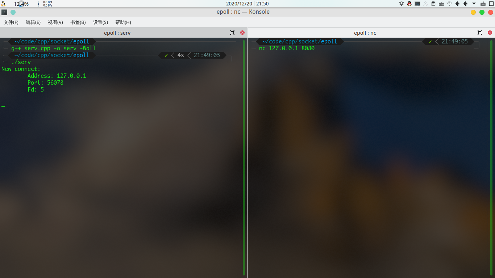
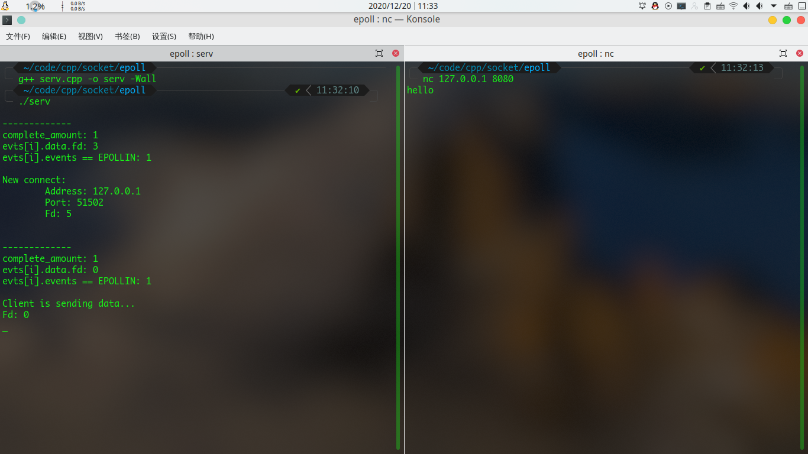
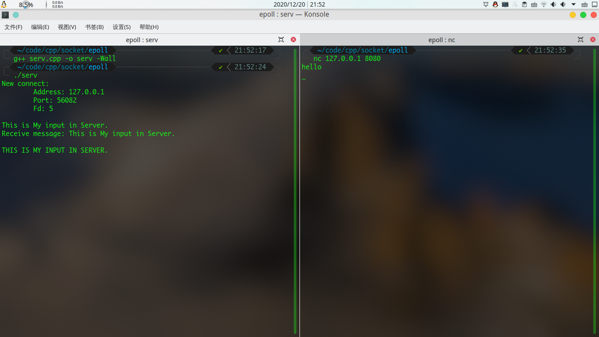
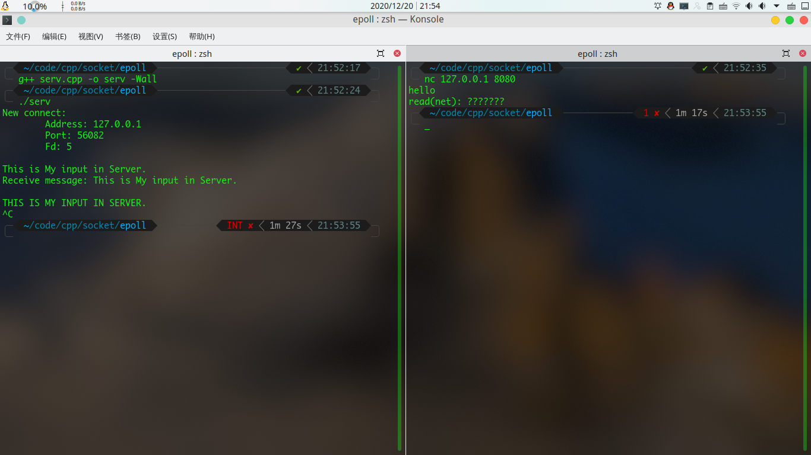

# 记初学epoll遇到的坑--关于epoll_event

---

> 2020-12-20
>
> ## Index
>
> * [PART_01 引言](#part_01-引言)
> * [PART_02 问题发生](#part_02-问题发生)
> * [PART_03 问题解决](#part_03-问题解决)

<audio id="music-audio" src="./music/Bloom-of-youth.mp3" controls="controls" loop>
您的浏览器不支持 audio 标签.
</audio>
>  《Bloom of Youth》	by 清水淳一


## PART_01 引言

刚开始学Linux下的epoll接口，第一个epoll程序就遇到了问题.

主要涉及知识：

* C/C++
* C++ STL容器
* Linux socket基础
* Linux 部分epoll族函数


## PART_02 问题发生

写了一个epoll小程序。

程序逻辑：客户端发送给服务端一串字符串，服务端 把字符串中的每个字符 转换成大写 然后发送给客户端。

代码：

```c++
#include <sys/epoll.h>
#include <sys/socket.h>
#include <arpa/inet.h>
#include <strings.h>
#include <ctype.h>
#include <unistd.h>
#include <signal.h>

#include <iostream>
#include <cassert>
#include <vector>
#include <string>

#define PORT 8080
#define LISTEN_MAX 1024

struct Sockobj
{
    int fd;
    struct sockaddr_in addr;
    struct epoll_event evt;
    socklen_t addrlen;
};

int main()
{
    /* 保存每个函数调用的返回值，用来判断函数是否返回-1，即函数出错 */
    int ret {0};

    /* 保存 epoll_wait() 的返回值 */
    int complete_amount {0};

    /* 无聊且枯燥的一段代码 */
    struct Sockobj serv;
    serv.fd = socket(AF_INET, SOCK_STREAM, 0);
    serv.addr.sin_family = AF_INET;
    serv.addr.sin_addr.s_addr = htonl(INADDR_ANY);
    serv.addr.sin_port = htons(PORT);
    serv.addrlen = sizeof(serv.addr);
    
    unsigned int value = 1;
    setsockopt(serv.fd, SOL_SOCKET, SO_REUSEADDR, &value, sizeof(value));
    ret = bind(serv.fd, (struct sockaddr *)&serv.addr, serv.addrlen);
    assert(ret != -1);

    ret = listen(serv.fd, LISTEN_MAX);
    assert(ret != -1);

    
    /* Epoll 出现了 */
    int epfd = epoll_create(LISTEN_MAX);
    assert(epfd > 0);

    serv.evt.events = EPOLLIN;
    serv.evt.data.fd = serv.fd;
    ret = epoll_ctl(epfd, EPOLL_CTL_ADD, serv.fd, &serv.evt);
    assert(ret != -1);

    struct epoll_event evts[LISTEN_MAX];
    std::vector<struct Sockobj> clies(LISTEN_MAX);
    auto cliesptr = clies.begin();

    /* 每次 epoll_wait() 返回后，都会有一个epoll_event型数组传出，
     * currentfd用来保存 epoll_event型数组中每个成员的 fd，
     * 用以判断是新客户端连接还是客户端发送数据.
     * 往下看你就明白了.
     * */
    int currentfd;

    /* 开始业务逻辑 */
    while (true) {
        complete_amount = epoll_wait(epfd, evts, LISTEN_MAX, -1);
        for (int i = 0; i < complete_amount; i++) {
            if (!(evts[i].events & EPOLLIN))    
                continue;

            currentfd = evts[i].data.fd;
            if (currentfd == serv.fd) {           /* 有新客户端要建立连接 */
                struct Sockobj tempclie;
                    tempclie.addrlen = sizeof(tempclie.addr);
                    tempclie.evt.events = EPOLLIN;
                clies.push_back(tempclie);
                cliesptr = --clies.end();
    
                /* 新客户端的socket文件描述符 塞进 epoll 里监听着 */
                cliesptr->fd = accept(serv.fd,
                        (struct sockaddr *)&clies.back().addr,
                        &clies.back().addrlen);
                ret = epoll_ctl(epfd, EPOLL_CTL_ADD, cliesptr->fd, &cliesptr->evt);
                assert(ret != -1);
            
                /* 输出一下 */
                char address [33];
                std::cout << "New connect: " << std::endl
                    << "\tAddress: "
                    << inet_ntop(AF_INET, 
                            &clies.back().addr.sin_addr.s_addr, address, 33)
                    << std::endl
                    << "\tPort: " << ntohs(cliesptr->addr.sin_port) << std::endl
                    << "\tFd: " << cliesptr->fd << std::endl
                    << std::endl;
            }
            else { 
                /* 客户端socket文件描述符可读: 要么关闭连接，要么有新数据来 */
                std::string buf(BUFSIZ, 0);
                int dataamount = read(currentfd, &buf.front(), BUFSIZ);
                if (dataamount == 0) {
                    /* 客户端关闭连接 */
                    std::cout << "Client " << currentfd << " closed." << std::endl;
                    /* 客户端socket文件描述符，踢出 epoll */
                    epoll_ctl(epfd, EPOLL_CTL_DEL, currentfd, NULL);
                    close(currentfd);
                }
                else {
                    /* 客户端发来新数据 */
                    std::cout << "Receive message: " << buf << std::endl;
                    for (int i = 0; i < dataamount; i++) {
                        /* 转换成大写 */
                        buf[i] = toupper(buf[i]);
                    }
                    /* 发给客户端 */
                    write(currentfd, &buf.front(), dataamount);
                    bzero(&buf.front(), dataamount);
                }
            }
        }
    }
    return 0;
}
```

貌似码得没毛病.

来运行一下(图片按时间顺序)：











我在客户端连接服务端，并发送了一句hello，发现没反应，又在服务端输入了一些东西，这才有反应，也就是说...epoll跑去监听0号文件描述符(标准输入)了？？？


## PART_03 问题解决

代码里一定有哪一句话，把0号文件描述符塞进epoll里面了。

0，说明可能是默认值被当作文件描述符 塞进了epoll里！

由这个思路寻找，终于找到问题所在了。

这是修改后正确运行的代码：

```c++
#include <sys/epoll.h>
#include <sys/socket.h>
#include <arpa/inet.h>
#include <strings.h>
#include <ctype.h>
#include <unistd.h>
#include <signal.h>

#include <iostream>
#include <cassert>
#include <vector>
#include <string>

#define PORT 8080
#define LISTEN_MAX 1024

struct Sockobj
{
    int fd;
    struct sockaddr_in addr;
    struct epoll_event evt;
    socklen_t addrlen;
};

int main()
{
    /* 保存每个函数调用的返回值，用来判断函数是否返回-1，即函数出错 */
    int ret {0};

    /* 保存 epoll_wait() 的返回值 */
    int complete_amount {0};

    /* 无聊且枯燥的一段代码 */
    struct Sockobj serv;
    serv.fd = socket(AF_INET, SOCK_STREAM, 0);
    serv.addr.sin_family = AF_INET;
    serv.addr.sin_addr.s_addr = htonl(INADDR_ANY);
    serv.addr.sin_port = htons(PORT);
    serv.addrlen = sizeof(serv.addr);
    
    unsigned int value = 1;
    setsockopt(serv.fd, SOL_SOCKET, SO_REUSEADDR, &value, sizeof(value));
    ret = bind(serv.fd, (struct sockaddr *)&serv.addr, serv.addrlen);
    assert(ret != -1);

    ret = listen(serv.fd, LISTEN_MAX);
    assert(ret != -1);

    
    /* Epoll 出现了 */
    int epfd = epoll_create(LISTEN_MAX);
    assert(epfd > 0);

    serv.evt.events = EPOLLIN;
    serv.evt.data.fd = serv.fd;
    ret = epoll_ctl(epfd, EPOLL_CTL_ADD, serv.fd, &serv.evt);
    assert(ret != -1);

    struct epoll_event evts[LISTEN_MAX];
    std::vector<struct Sockobj> clies(LISTEN_MAX);
    auto cliesptr = clies.begin();

    /* 每次 epoll_wait() 返回后，都会有一个epoll_event型数组传出，
     * currentfd用来保存 epoll_event型数组中每个成员的 fd，
     * 用以判断是新客户端连接还是客户端发送数据.
     * 往下看你就明白了.
     * */
    int currentfd;

    /* 开始业务逻辑 */
    while (true) {
        complete_amount = epoll_wait(epfd, evts, LISTEN_MAX, -1);
        for (int i = 0; i < complete_amount; i++) {
            if (!(evts[i].events & EPOLLIN))    
                continue;

            currentfd = evts[i].data.fd;
            if (currentfd == serv.fd) {           /* 有新客户端要建立连接 */
                struct Sockobj tempclie;
                    tempclie.addrlen = sizeof(tempclie.addr);
                    tempclie.evt.events = EPOLLIN;
                clies.push_back(tempclie);
                cliesptr = --clies.end();
    
                /* 新客户端的socket文件描述符 塞进 epoll 里监听着 */
                cliesptr->fd = accept(serv.fd,
                        (struct sockaddr *)&clies.back().addr,
                        &clies.back().addrlen);
                cliesptr->evt.data.fd = cliesptr->fd;
                ret = epoll_ctl(epfd, EPOLL_CTL_ADD, cliesptr->fd, &cliesptr->evt);
                assert(ret != -1);
            
                /* 输出一下 */
                char address [33];
                std::cout << "New connect: " << std::endl
                    << "\tAddress: "
                    << inet_ntop(AF_INET, 
                            &clies.back().addr.sin_addr.s_addr, address, 33)
                    << std::endl
                    << "\tPort: " << ntohs(cliesptr->addr.sin_port) << std::endl
                    << "\tFd: " << cliesptr->fd << std::endl
                    << std::endl;
            }
            else { 
                /* 客户端socket文件描述符可读: 要么关闭连接，要么有新数据来 */
                std::string buf(BUFSIZ, 0);
                int dataamount = read(currentfd, &buf.front(), BUFSIZ);
                if (dataamount == 0) {
                    /* 客户端关闭连接 */
                    std::cout << "Client " << currentfd << " closed." << std::endl;
                    /* 客户端socket文件描述符，踢出 epoll */
                    epoll_ctl(epfd, EPOLL_CTL_DEL, currentfd, NULL);
                    close(currentfd);
                }
                else {
                    /* 客户端发来新数据 */
                    std::cout << "Receive message: " << buf << std::endl;
                    for (int i = 0; i < dataamount; i++) {
                        /* 转换成大写 */
                        buf[i] = toupper(buf[i]);
                    }
                    /* 发给客户端 */
                    write(currentfd, &buf.front(), dataamount);
                    bzero(&buf.front(), dataamount);
                }
            }
        }
    }
    return 0;
}
```

找到不同点了吗？就在第89行，`/* 新客户端的socket文件描述符 塞进 epoll 里监听着 */`这个注释的下面一点，accept()函数下面一行。

虽说epoll_ctl()函数中已经把客户端socket的文件描述符作为第三个参数传入，但epoll_event结构体里的data里的fd，一定不能忘记！！！


<base target="_blank" />
<script>
	var audio = document.getElementById("music-audio");
	if (audio == null) {
		console.log("ERROR::audio is null.");
	}
	else {
		audio.volume = 0.05;
	}
</script>